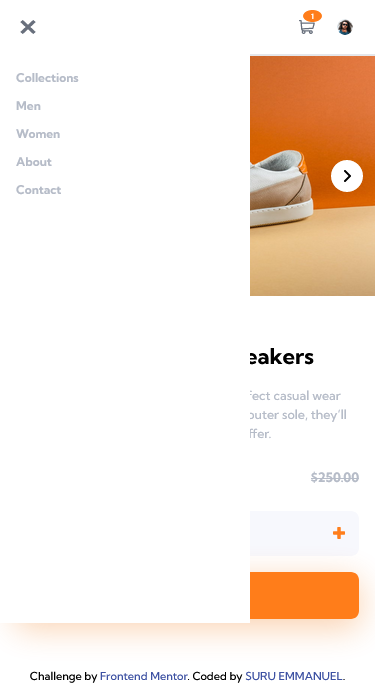
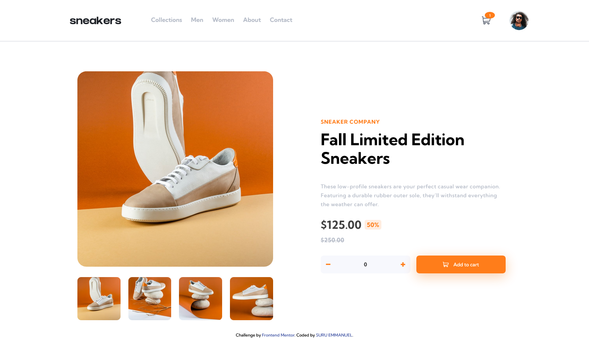

# Frontend Mentor - E-commerce product page solution

This is a solution to the [E-commerce product page challenge on Frontend Mentor](https://www.frontendmentor.io/challenges/ecommerce-product-page-UPsZ9MJp6).
## Table of contents

- [Overview](#overview)
  - [The challenge](#the-challenge)
  - [Screenshot](#screenshot)
  - [Links](#links)
- [My process](#my-process)
  - [Built with](#built-with)
  - [What I learned](#what-i-learned)
  - [Continued development](#continued-development)
  - [Useful resources](#useful-resources)
- [Author](#author)
- [Acknowledgments](#acknowledgments)

## Overview

### The challenge

Users should be able to:

- View the optimal layout for the site depending on their device's screen size
- See hover states for all interactive elements on the page
- Open a lightbox gallery by clicking on the large product image
- Switch the large product image by clicking on the small thumbnail images
- Add items to the cart
- View the cart and remove items from it

### Screenshot

### Links
- Solution URL: (https://github.com/suruaino/challenge13.git)
- Live Site URL: (https://suru-ecommerce.netlify.app/)

## My process

### Built with

- Semantic HTML5 markup
- CSS custom properties
- Flexbox
- CSS Grid
- Mobile-first workflow
- Tailwindcss
- JavaScript

### What I learned

I improved my skills with css flex property and the use of tailwindcss and advanced more on JavaScript. 

### Continued development

I will want to learn and know more about accessibilty, more complex form validation and meaning & use of API.

### Useful resources

- [Google](https://www.google.com) - Always my first option before requesting help from anybody. Whenever i am confused, I always run to google. Its a good resource any coder.
- [Tailwind doc](https://www.tailwindcss/docs.com) - It is my most used resource. I only used others when a concept is confusing.

## Author

- SURU EMMANUEL
- Frontend Mentor - [@suruaino](https://www.frontendmentor.io/profile/suruaino)
- Twitter - [@suruaino](https://www.twitter.com/suruaino)

## Acknowledgments

I will want to use this opportunity to thank my lovely sister Ojeifo Loveth and her husband Obende Daniel for their support and encouragement and the strenght-filled challanges that they always set for me. They kept pushing me right from the day I started this journey till date. They never got tired. I want to say a very bih thank you to that family.
